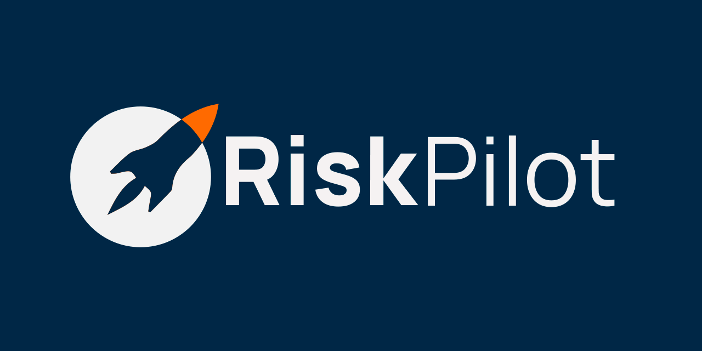

<!-- Banner / Logo -->

  

<h1 align="center">Mentoria em Ciência de Dados aplicada ao Risco de Crédito</h1>

  🚀 Programa 100 % gratuito &nbsp;|&nbsp; Hands-on &nbsp;|&nbsp; Foco em Basel II/III, IFRS 9 e Resolução 4966

  <!-- Badges (opcional) -->
  
  
  

---

## 📑 Sobre a mentoria

Esta mentoria é uma jornada **prática** e **estruturada** para quem já domina o básico de Python e quer mergulhar em:

- Definição de público **performing** (Basel/EBA)
- Amostragem **snapshot vs. painel** e pesos para datasets desbalanceados
- Construção de **targets** PD behavior (EVER / OVER)
- **Feature engineering** estático e histórico + OptimalBinning “na unha”
- Modelagem com **Regressão Logística** e **XGBoost**  
  &nbsp;&nbsp;• **Optuna** para _hyperparameter tuning_  
  &nbsp;&nbsp;• Métricas de performance tradicionais
- **Perfis de risco**, clustering e explicabilidade com **SHAP**
- Melhores práticas de versionamento, MLOps (MLflow) e publicação no **GitHub**

> 🗓 **Duração:** 6 semanas &nbsp;|&nbsp; **Encontro:** 1–2 h/semana &nbsp;|&nbsp; **Formato:** remoto e ao vivo  
> 📂 **Material:** cada pasta `ENCONTRO_X/` será adicionada aqui **logo após** a respectiva aula.

---

## 🔖 Estrutura do repositório